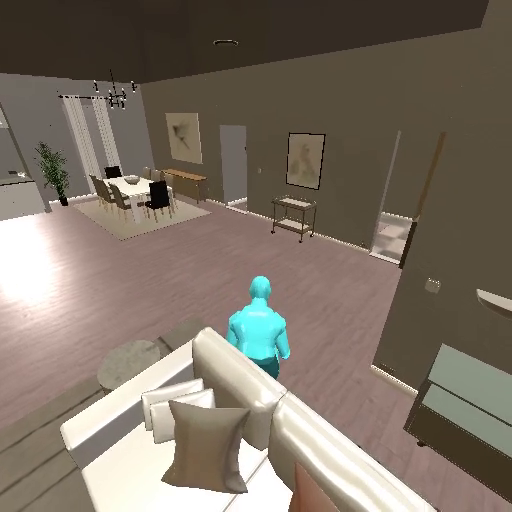
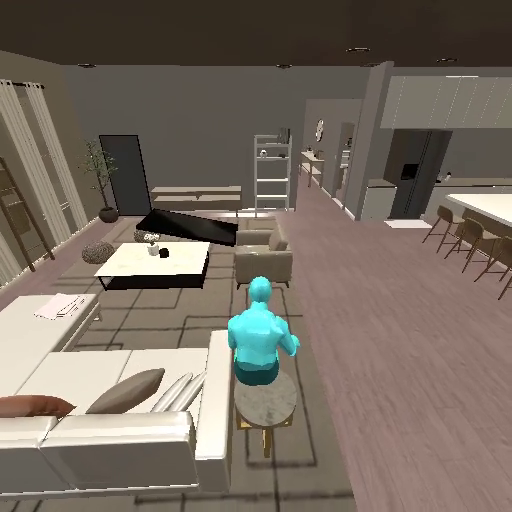

# pi-embodied 仿真回归与 HumanCLAW 诊断

日期：2026-10-01（UTC+8）。按用户要求，Franka、双 Franka、Piper、UR5e 四类真机实机验收暂缓。本报告不把环境启动、模型口头成功或导航成功当作任务完成。

## 版本与变更

- 基线：`4b70d988b094c1498301393362484a3d5836012c`，包含前一天的上游 pi 0.99.1 合并和部署统一。
- 本次仿真最终代码：`4c9982020d1fcabcfcb6e19d866cf3899b34daba`。测试结束前保持独立工作区版本冻结；报告后续提交只增加验收材料。
- `3a4baf4c43aad21d7f36e643a8e2a6adf311cc40`：增加默认关闭的 `--humanclaw-proprioception`。仅返回身体自身的实际转角、水平位移长度和相对高度；不返回目标坐标或目标接触判定。反馈来自仿真器自身位姿，属于新增观测条件，必须与原视觉设置分开；paper 模式拒绝启用。
- `4c9982020`：明确 ManiSkill PickCube 的绿色球是空中的非实体位置标记，要求把方块中心对齐并保持静止；它不是装方块的容器。未修改任务成功阈值、物理或奖励。
- 部署继续使用 `/usr/local/bin/pi`、主仓库 `/root/autodl-tmp/pi` 和其中的 services。Qwen 显式选择 `selfhost/qwen3.8-27b`，ninfer 服务 GPU 0，仿真 GPU 1。
- ninfer 与权重仍沿用 [前次部署记录](../2026-09-30/report.md) 的固定版本，未因本轮诊断替换推理服务。

## 11 个仿真环境同版本检查

冻结提交 `4c9982020`，每个环境一个固定用例，真实 reset → 图像观测 → 一次动作 → finish → 结果落盘。此层不调用 Qwen，不是完整任务成功率，也不覆盖每个仓库的全部任务。

| 环境 | 结果 |
|---|---|
| metaworld | 通过 |
| genesis | 通过 |
| maniskill | 通过 |
| libero | 通过 |
| robosuite | 通过 |
| robocasa | 通过 |
| robotwin | 通过 |
| robolab | 通过 |
| robodojo | 通过 |
| behavior | 未通过（退出码 1） |
| humanclaw | 通过 |

**最终 10/11 通过；BEHAVIOR 未通过。** 指定数据根目录后，现有适配器仍按旧 `og_dataset/scenes/.../*_template.json` 查找任务；本机数据分为 `behavior-1k-assets` 与 2025/2026 challenge 实例，新实例使用 `*-tro_state.json` 布局。需要完成适配器与现有数据/API 的兼容，不能把此前独立加载 probe 算成本次通过。

最终日志：`/root/autodl-tmp/runs/same-version-final-20261001/`。`commit.txt` 和 `extended-commit-after.txt` 保存运行前后版本；各日志中的 robot_result 保存具体任务、步数、错误和上下文版本。原始诊断日志保留在 `same-version-20261001/`，不与最终矩阵混算。

已修复的部署/测试设置问题：RoboSuite 使用 EGL；RoboCasa 安装目录缺少指向已下载 objects、fixtures、textures 等资源的连接，已补齐缺项且保留已有文件；测试驱动的 finish 事件补全 input 参数，单臂 ManiSkill 不传 arm 参数。BEHAVIOR 显式使用已下载的 OMNIGIBSON_DATA_PATH。RoboLab 使用现场已有的 Isaac 6.1 适配目录与 robolab60 Python 环境。这里只报告本机配置的实测结果。

## 新 Qwen 的固定任务回归

6 个固定用例：MetaWorld reach-v3、ManiSkill PickCube-v1、LIBERO spatial task 0，各种子 0/1。全程代码冻结在 `4b70d988b`，thinking=low、units=true、最多 40 轮、每任务 300 秒，禁用 skills/prompt templates，使用起始为空的独立本地任务记忆目录。场景本身仍为已知固定诊断用例，不是未见测试集。部分回合与 HumanCLAW 诊断共享模型服务并行运行，时间预算可能受竞争影响，因此仅作为本机联调回归，不作独立吞吐或公平模型比较。

**6 次尝试：1 成功、4 任务失败、1 工具调用格式错误。有效任务为 1/5；按全部计划用例计成功 1/6。**

| 用例 | 结果 | 环境步数 | 预算耗尽 |
|---|---|---:|---|
| libero_spatial_t0_s0 | planner_error | 0 | — |
| libero_spatial_t0_s1 | failure | 283 | time |
| PickCube-v1_s0 | failure | 282 | turns |
| PickCube-v1_s1 | failure | 331 | turns |
| reach-v3_s0 | success | 168 | — |
| reach-v3_s1 | failure | 266 | time |

LIBERO seed 0 在第一轮生成了缺少 `<` 的 `function=read>` 标签，ninfer 未把它解析成工具调用，pi 正确地将其判为 planner_error；该回合没有执行动作。未用宽松解析自动执行坏格式文本，也未重试覆盖这个失败。

ManiSkill 原提示使 Qwen 把绿色目标球理解为容器。修正后在 `4c9982020` 又跑相同两个种子、相同预算和独立空白记忆：**0/2**，分别 255、261 环境步，均用尽时间。该诊断与 HumanCLAW 部分并行共享模型服务，不能据此作延迟或公平性能比较。任务说明更准确，但尚不能声称成功率改善。

旧记忆回归与空白记忆回归的设置不同；两次单样本结果的变化不构成提升证据。没有与 Muse 做等条件对照。

## HumanCLAW：指标改善与视觉验收分开

固定沙发任务 `104348028_171512877_ep1_couch`，pi 模式、900 秒、开启上述自身运动反馈、原生 metrics。两次均无特权目标位置。第一遍代码 `3a4baf4c4`，第二遍 `4c9982020`；两者 HumanCLAW 源码一致，后者仅增加 ManiSkill 任务说明修正。

| 运行 | 步数 | NavSR@20cm | 原生 InteractSR | 碰撞步比例 | 视觉验收 |
|---|---:|---|---|---:|---|
| 第一次 | 29 | True | True | 67.9% | 人在沙发背侧，不能确认由座面承托 |
| 同场景复跑 | 38 | True | True | 45.9% | 人位于沙发旁圆桌位置，未验收为正确坐到沙发座面 |

**同一场景原生 InteractSR 为 2/2，但正确坐下仍未验收通过。** 这不是两个独立场景的成功率，更不是完整 HumanCLAW benchmark。

核对上游 `evaluation/metrics/episode.py`：InteractSR 要求交互任务、主动停止、至少一次 sit，且最后运动末帧骨盆接触目标网格；它不单独区分座面、靠背或邻近家具支撑。指标原样保留，不以自定义阈值覆盖。`result.status=success` 本身仍表示导航结果，不能替代 InteractSR 或人工画面验收。

官方轨迹回放恢复保存的物理后状态，未重新生成动作。以下末帧是诊断证据：

原始运行：`/root/autodl-tmp/runs/humanclaw/qwen-proprioception-20261001/` 和 `qwen-proprioception-repeat-20261001/`。官方 ego/exo 视频分别在 `qwen-proprioception-render-20261001/` 和 `qwen-proprioception-repeat-render-20261001/`。

## 工程验证与未完成项

- 完整 `npm run check`；HumanCLAW 新增反馈相关 Node 测试 15 通过、Python 测试 10 通过；ManiSkill 相关 Python 测试 36 通过、1 跳过。Python ruff 通过。最终完整检查退出码 0；检查日志 `/tmp/pi-oct01-final-check.log`。
- Python 测试仍有已有的 pytest timeout 插件配置警告；模拟测试不能替代上述真实环境检查。
- HumanCLAW 的关键未完成项是正确座面定位、座面承托验证和反复碰撞恢复。自身运动反馈提供了区分命令转角与实际转角的信息，但本轮没有证明实际坐姿可靠。
- Qwen 任务成功率仍低；应针对定位、抓取和终止判定做独立诊断，再用同一版本、串行模型调用、固定预算和多个独立场景验收。
- 真机实机验收按用户要求暂缓。

原始结果汇总见 [results.json](results.json)。
